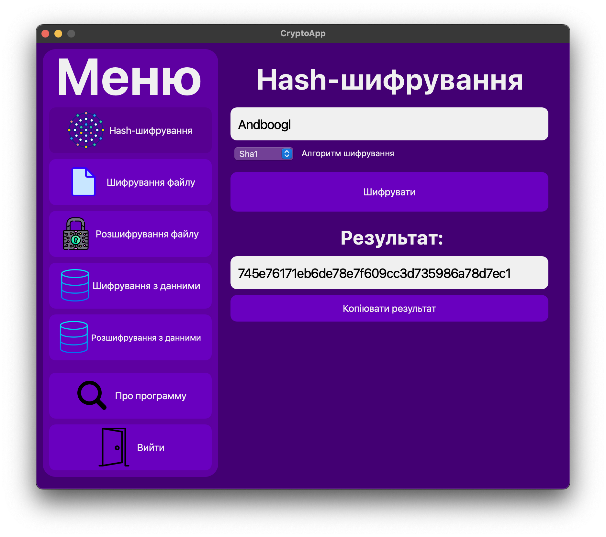

# CryptoApp
Программа для шифрування файлів, розшифрування файлів та хешування строк

# Плюси программи
    - Новий дизайн
    - Багато функцій
    - Іконки
    - Відкритий вихідний код
    - Зрозумілість

# Що нового тут є?
    - Віджет QStackedWidget, за допомогою якого перемикається меню
    - Хешування за допомогою хеш-алгоритмів
    - Оптимізація коду. Тепер ви не побачите 300 строк у одному файлі :)

# Бібліотекі, які використовуються
    - PyQt6 - графічний інтерфейс
    - pyAesCrypt - шифрування на розшифрування файлів на основі технології AES

# Демонстрація ПЗ

На цих фото ви бачите версію программи 0.0.0